> 在线视频：[尚硅谷新版SSM框架全套视频教程，Spring6+SpringBoot3最新SSM企业级开发](https://www.bilibili.com/video/BV1AP411s7D7)
> 
> 在线文档：[高效构建Java应用：Maven入门和进阶](https://www.wolai.com/fbnhGx8eE9JfZugFpbCWmC)
> 
> 课程资料：https://pan.baidu.com/s/1R8Q-u4xV5rKOSTL8cRpwfQ?pwd=jf3x
>
> 代码仓库:
> 
> Gitee: https://gitee.com/an_shiguang/learn-ssm
> 
> GitHub: https://github.com/Shiguang-coding/learn-ssm


# Maven简介和快速入门

## Maven介绍

> [What is Maven?](https://maven.apache.org/what-is-maven.html)

Maven 是一款为 Java 项目构建管理、依赖管理的工具（**软件**），使用 Maven 可以自动化构建、测试、打包和发布项目，大大提高了开发效率和质量。

总结：Maven就是一个软件，掌握软件安装、配置、以及基本功能**（项目构建、依赖管理）**使用就是本课程的主要目标！

## Maven主要作用理解

> [Maven Releases History](https://maven.apache.org/docs/history.html)

选用版本: 

| 发布时间           | maven版本 | jdk最低版本 |
| ------------------ | --------- | ----------- |
| **2019 - 11 - **25 | **3.6.**3 | Java 7      |

下载地址：[apache-maven-3.6.3-bin.zip ](https://archive.apache.org/dist/maven/maven-3/3.6.3/binaries/)

## 安装

**安装条件：**maven需要本机安装java环境、必需包含java_home环境变量！

**软件安装：**右键解压即可（绿色免安装）

软件结构：

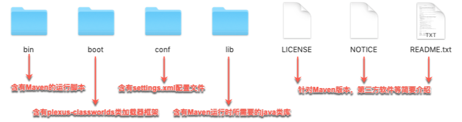

### 环境变量

配置环境变量路径: `设置 -> 系统 -> 高级系统设置 -> 环境变量 -> 系统变量`

> 用户变量：只针对用当前登录的用户有效
>
> 系统变量：此电脑的任意用户均有效

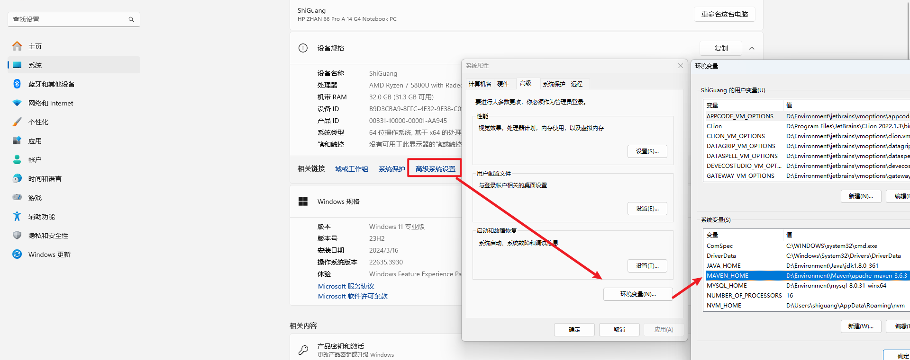

Maven依赖JAVA环境，配置前先检查下`JAVA_HOME`是否已配置好

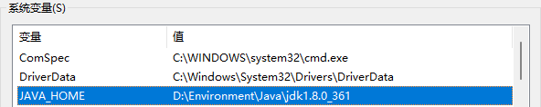

添加系统环境变量：配置`MAVEN_HOME` 和 `Path`

`MAVEN_HOME`为Maven文件所在目录，bin的上一级目录

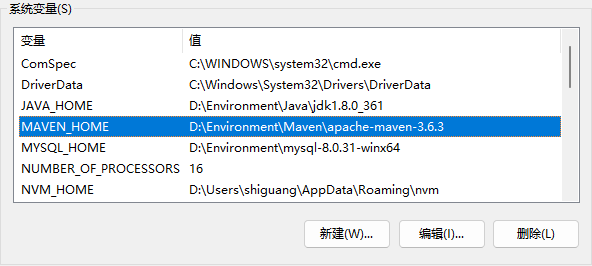

配置`Path`环境变量时可以直接填写到Maven bin目录，也可直接引用`MAVEN_HOME`的环境变量，这样当`MAVEN_HOME`改变时就不用重新修改 `Path` 环境变量了。

> 配置 `Path` 环境变量的目的是为了不用切换到Maven目录也可在任意目录调用Maven命令

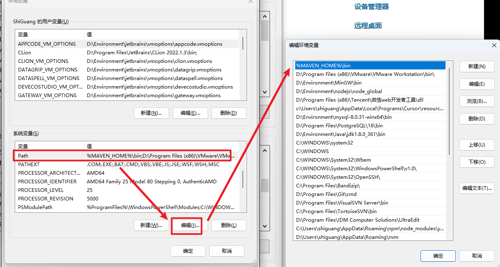

### 命令测试

配置好后，可以执行 `mvn -v` 检查下配置是否生效，如果错误，请仔细检查环境变量即可！

如果此处错误，绝大部分原因都是`JAVA_HOME`变量的事，请仔细检查！！

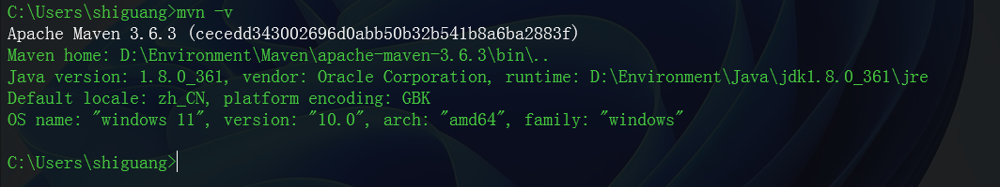

## 配置文件

> 我们需要需改`maven/conf/settings.xml`配置文件，来修改maven的一些默认配置。
>
> 我们主要休要修改的有三个配置：
>
> 1.依赖本地缓存位置（本地仓库位置）
>
> 2.maven下载镜像
>
> 3.maven选用编译项目的jdk版本！

### 配置本地仓库地址

> 若不配置本地仓库地址，默认存放路径为：`C:\Users\xxx\.m2\repository`
>
> 本地仓库指向的目录可以不存在，创建缓存时会自动创建

```xml
<!-- localRepository
 | The path to the local repository maven will use to store artifacts.
 |
 | Default: ${user.home}/.m2/repository
<localRepository>/path/to/local/repo</localRepository>
-->
<!-- conf/settings.xml 55行 -->
<!-- 本地仓库地址-->
<localRepository>D:\Environment\Maven\apache-maven-3.6.3\maven-repo</localRepository>
```

### 配置国内阿里镜像

> Maven查找规则：
>
> 先在本地查找，找不到再去中央仓库查找，中央仓库在国外，配置国内镜像能提高下载速度

```xml
<!--在mirrors节点(标签)下添加中央仓库镜像 160行附近-->
<mirror>
    <id>alimaven</id>
    <name>aliyun maven</name>
    <url>http://maven.aliyun.com/nexus/content/groups/public/</url>
    <mirrorOf>central</mirrorOf>
</mirror>
```

### 配置jdk17版本项目构建

```xml
<!--在profiles节点(标签)下添加jdk编译版本 268行附近-->
<profile>
    <id>jdk-17</id>
    <activation>
      <activeByDefault>true</activeByDefault>
      <jdk>17</jdk>
    </activation>
    <properties>
      <maven.compiler.source>17</maven.compiler.source>
      <maven.compiler.target>17</maven.compiler.target>
      <maven.compiler.compilerVersion>17</maven.compiler.compilerVersion>
    </properties>
</profile>
```

## IDEA配置本地Maven

> 我们需要将配置好的maven软件，配置到idea开发工具中即可！ 
>
> 注意：idea工具默认自带maven配置软件，但是因为没有修改配置，建议替换成本地配置好的maven！
>
> 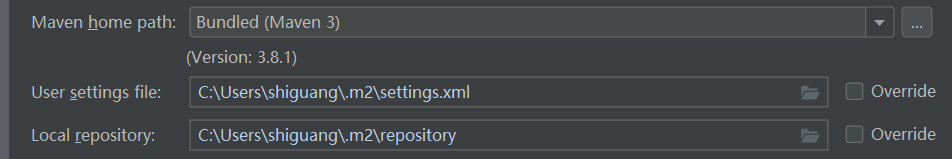


配置路径：`File -> Settings -> Build,Execution,Deployment -> Build Tools -> Maven`

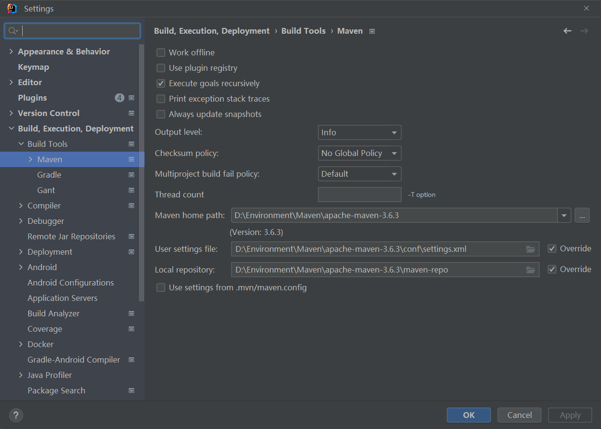

**测试是否配置成功**

**注意**：如果本地仓库地址不变化，只有一个原因，就是`maven/conf/settings.xml`配置文件编写错误！仔细检查即可！

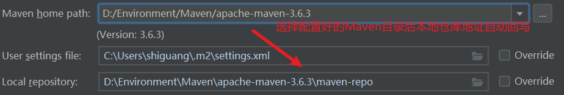

由于各java项目间相互独立，每次打开新的项目均需检查下当前项目配置的Maven是否正确

也可更改默认配置，关闭项目后，找到 `Customize -> Configure` 然后按照上面的操作配置即可，这样每次打开新的项目也都是相同的配置了。

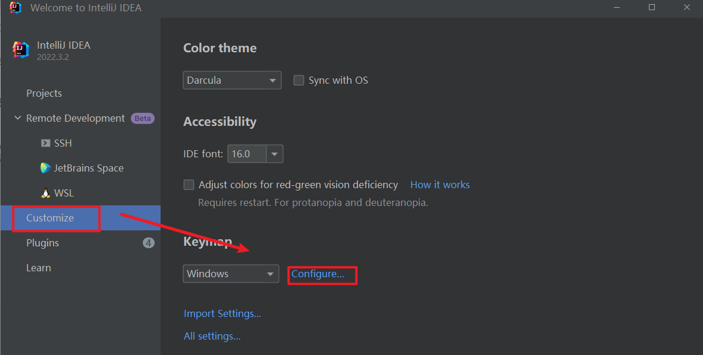

# 基于IDEA的Maven工程创建

## 梳理Maven工程GAVP属性

> Maven工程相对之前的工程，多出一组gavp属性
>
> gav需要我们在创建项目的时指定，p有默认值，后期通过配置文件修改。

Maven 中的 `GAVP` 是指 `GroupId`、`ArtifactId`、`Version`、`Packaging` 等四个属性的缩写，其中前三个是必要的，而 Packaging 属性为可选项。这四个属性主要为每个项目在maven仓库总做一个标识，类似人的《姓-名》。有了具体标识，方便maven软件对项目进行管理和互相引用！

GAV遵循以下规则：

1） **GroupID 格式**：com.{公司/BU }.业务线.[子业务线]，最多 4 级。

  说明：组织标识，{公司/BU} 例如：alibaba/taobao/tmall/aliexpress 等 BU 一级；子业务线可选。

  正例：com.taobao.tddl 或 com.alibaba.sourcing.multilang  com.atguigu.java

2） **ArtifactID 格式**：产品线名-模块名。语义不重复不遗漏，先到仓库中心去查证一下。

  说明：文件标识，不重复即可，微服务项目一般为 项目名+ 模块名，单体项目相当于一个项目名

  正例：tc-client / uic-api / tair-tool / bookstore

3） **Version版本号格式推荐**：主版本号.次版本号.修订号 1.0.0

  1） 主版本号（模块调整）：当做了不兼容的 API 修改，或者增加了能改变产品方向的新功能。

  2） 次版本号（功能调整）：当做了向下兼容的功能性新增（新增类、接口等）。

  3） 修订号（bug调整）：修复 bug，没有修改方法签名的功能加强，保持 API 兼容性。

  例如： 初始→1.0.0 ， 修改bug → 1.0.1，  功能调整 → 1.1.1，模块调整→ 2.0.0

Packaging定义规则：

指示将项目打包为什么类型的文件，idea根据packaging值，识别maven项目类型！

packaging 属性为 jar（默认值），代表普通的Java工程，打包以后是.jar结尾的文件。

packaging 属性为 war，代表Java的web工程，打包以后.war结尾的文件。

packaging 属性为 pom，代表不会打包，用来做继承的父工程。

## Idea构建Maven JavaSE工程

创建一个空项目

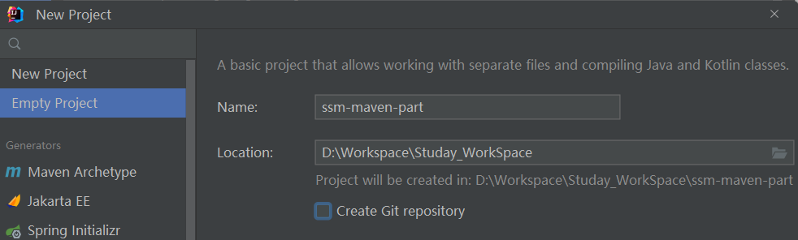

在该项目上创建一个Model

> 创建时ArtifactID默认与Name相同，两者可以不一致
>
> Name为该项目在本地存储的文件夹名称，ArtifactID为项目在Maven中的定位标识名称

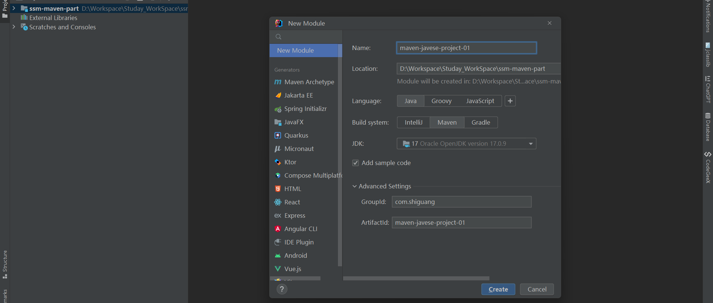

创建好后项目结构如下

> 默认只有GAV标识，因为Packing默认为jar
>
> 版本号 1.0-SNAPSHOT 也可改为具体版本号，如 1.0.0

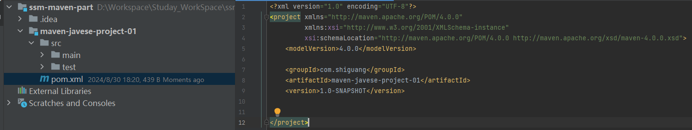

## Idea构建Maven JavaEE工程

### 手动创建

第一步：创建一个Java SE Maven工程

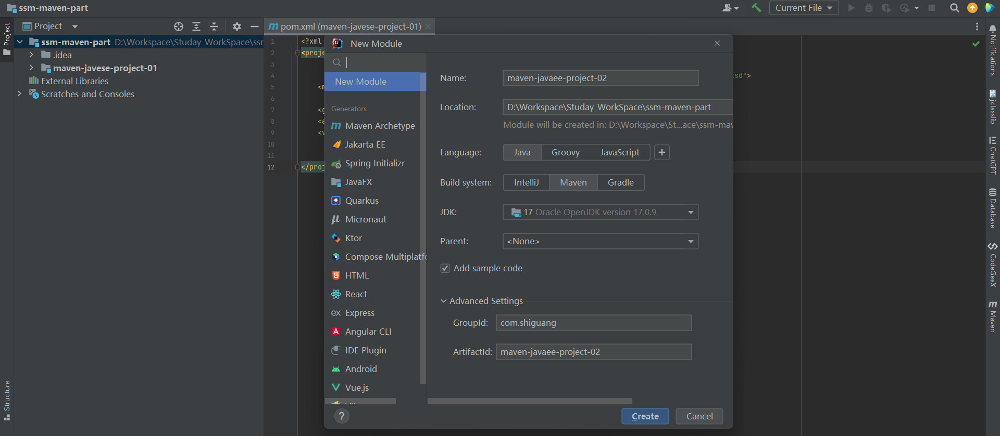

第二步：手动添加web项目结构文件

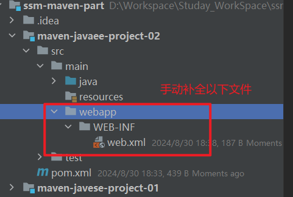

**注意：结构和命名固定**

第三步：修改`pom.xml`打包方式，设置打包方式为`war`

```xml
 <packaging>war</packaging>
```

`web.xml`文件模板文件：

```xml
<?xml version="1.0" encoding="UTF-8"?>
<web-app xmlns="http://xmlns.jcp.org/xml/ns/javaee"
         xmlns:xsi="http://www.w3.org/2001/XMLSchema-instance"
         xsi:schemaLocation="http://xmlns.jcp.org/xml/ns/javaee http://xmlns.jcp.org/xml/ns/javaee/web-app_4_0.xsd"
         version="4.0">

</web-app>
```

第四步：刷新和校验

`pom.xml`文件修改后IDEA自动识别，出现刷新图标，点击刷新即可

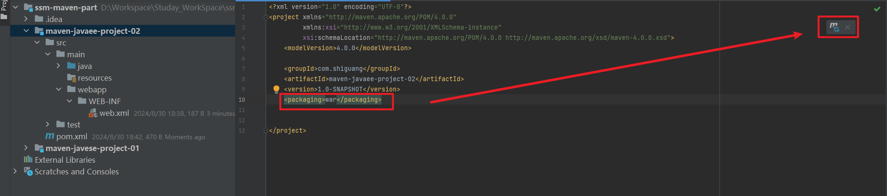

也可在工具栏进行刷新

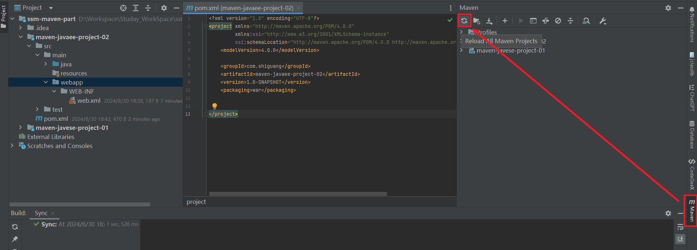

项目的`webapp`文件夹出现小蓝点，代表成功


### 插件创建

第一步：安装 `JBLJavaToWeb` 插件

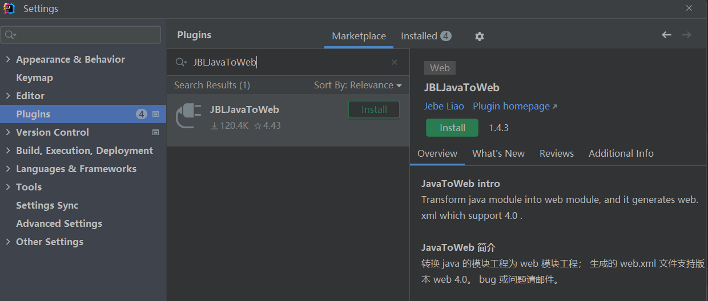

第二步：创建一个Java SE  Maven 工程

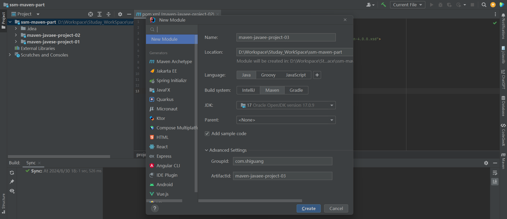

第三步：将Java SE 项目转换为Java EE 项目

选中要转换的项目右键 => JBLJavaToWeb

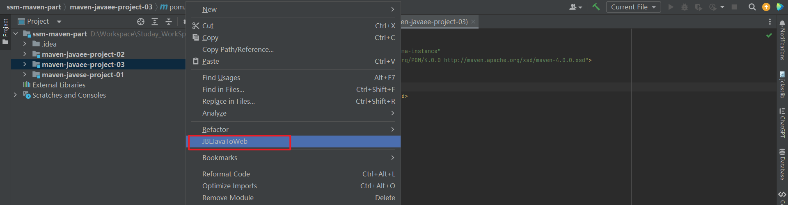

## Maven工程项目结构说明

Maven 是一个强大的构建工具，它提供一种标准化的项目结构，可以帮助开发者更容易地管理项目的依赖、构建、测试和发布等任务。

以下是 Maven Web 程序的文件结构及每个文件的作用：

```xml
|-- pom.xml                               # Maven 项目管理文件 
|-- src
    |-- main                              # 项目主要代码
    |   |-- java                          # Java 源代码目录
    |   |   `-- com/example/myapp         # 开发者代码主目录
    |   |       |-- controller            # 存放 Controller 层代码的目录
    |   |       |-- service               # 存放 Service 层代码的目录
    |   |       |-- dao                   # 存放 DAO 层代码的目录
    |   |       `-- model                 # 存放数据模型的目录
    |   |-- resources                     # 资源目录，存放配置文件、静态资源等
    |   |   |-- log4j.properties          # 日志配置文件
    |   |   |-- spring-mybatis.xml        # Spring Mybatis 配置文件
    |   |   `-- static                    # 存放静态资源的目录
    |   |       |-- css                   # 存放 CSS 文件的目录
    |   |       |-- js                    # 存放 JavaScript 文件的目录
    |   |       `-- images                # 存放图片资源的目录
    |   `-- webapp                        # 存放 WEB 相关配置和资源
    |       |-- WEB-INF                   # 存放 WEB 应用配置文件
    |       |   |-- web.xml               # Web 应用的部署描述文件
    |       |   `-- classes               # 存放编译后的 class 文件
    |       `-- index.html                # Web 应用入口页面
    `-- test                              # 项目测试代码
        |-- java                          # 单元测试目录
        `-- resources                     # 测试资源目录
```

`pom.xml`：Maven 项目管理文件，用于描述项目的依赖和构建配置等信息。

`src/main/java`：存放项目的 Java 源代码。

`src/main/resources`：存放项目的资源文件，如配置文件、静态资源等。

`src/main/webapp/WEB-INF`：存放 Web 应用的配置文件。

`src/main/webapp/index.html`：Web 应用的入口页面。

`src/test/java`：存放项目的测试代码。

`src/test/resources`：存放测试相关的资源文件，如测试配置文件等。

# Maven核心功能依赖和构建管理

## 依赖管理和配置

Maven 依赖管理是 Maven 软件中最重要的功能之一。Maven 的依赖管理能够帮助开发人员自动解决软件包依赖问题，使得开发人员能够轻松地将其他开发人员开发的模块或第三方框架集成到自己的应用程序或模块中，避免出现版本冲突和依赖缺失等问题。

我们通过定义 POM 文件，Maven 能够自动解析项目的依赖关系，并通过 Maven **仓库自动**下载和管理依赖，从而避免了手动下载和管理依赖的繁琐工作和可能引发的版本冲突问题。

**重点: 编写pom.xml文件**

### 项目信息属性配置和读取

```xml
<!-- 模型版本 -->
<modelVersion>4.0.0</modelVersion>
<!-- 公司或者组织的唯一标志，并且配置时生成的路径也是由此生成， 如com.companyname.project-group，maven会将该项目打成的jar包放本地路径：/com/companyname/project-group -->
<groupId>com.companyname.project-group</groupId>
<!-- 项目的唯一ID，一个groupId下面可能多个项目，就是靠artifactId来区分的 -->
<artifactId>project</artifactId>
<!-- 版本号 -->
<version>1.0.0</version>

<!--打包方式
    默认：jar
    jar指的是普通的java项目打包方式！ 项目打成jar包！
    war指的是web项目打包方式！项目打成war包！
    pom不会讲项目打包！这个项目作为父工程，被其他工程聚合或者继承！后面会讲解两个概念
-->
<packaging>jar/pom/war</packaging>
```

### 依赖管理和添加

```xml
<!-- 
   通过编写依赖jar包的gav必要属性，引入第三方依赖！
   scope属性是可选的，可以指定依赖生效范围！
   依赖信息查询方式：
      1. maven仓库信息官网 https://mvnrepository.com/
      2. 插件 maven-search
		 使用：Tools -> Maven Search
 -->
<dependencies>
    <!-- 引入具体的依赖包 -->
    <dependency>
        <groupId>log4j</groupId>
        <artifactId>log4j</artifactId>
        <version>1.2.17</version>
        <!--
            生效范围
            - compile(默认) ：main目录 test目录  打包和运行
            - provided：main目录 test目录  Servlet HttpServlet 运行时tomcat提供了servlet
            - runtime： 打包和运行(反射)  MySQL Class.forName(com.mysql.cj.jdbc.Driver)
            - test: test目录 junit
			总结：它是一个锦上添花的功能,如果掌握不好就用默认,全部生效,就一定不会报错!
         -->
        <scope>runtime</scope>
    </dependency>

</dependencies>
```

### 依赖版本提取和维护

```xml
<!--声明版本-->
<properties>
  <!--提取版本号,方便统一管理-->
  <!--
		支持自定义标签,命名随意,相当于声明了一个变量,在其他位置可以用${junit.version} 引用
		注意：声明的标签建议两层或以上命名,否则可能和Maven系统自带的变量冲突,推荐：技术名.version
	-->
  <junit.version>4.11</junit.version>
  <!-- 也可以通过 maven规定的固定的key，配置maven的参数！如下配置编码格式！-->
  <maven.compiler.source>17</maven.compiler.source>
  <maven.compiler.target>17</maven.compiler.target>
  <project.build.sourceEncoding>UTF-8</project.build.sourceEncoding>
  <project.reporting.outputEncoding>UTF-8</project.reporting.outputEncoding>
</properties>

<dependencies>
  <dependency>
    <groupId>junit</groupId>
    <artifactId>junit</artifactId>
    <!--引用properties声明版本 -->
    <version>${junit.version}</version>
  </dependency>
</dependencies>
```

### 依赖传递和冲突

**依赖传递**：指的是当一个模块或库 A 依赖于另一个模块或库 B，而 B 又依赖于模块或库 C，那么 A 会间接依赖于 C。这种依赖传递结构可以形成一个依赖树。当我们引入一个库或框架时，构建工具（如 Maven、Gradle）会自动解析和加载其所有的直接和间接依赖，确保这些依赖都可用。

依赖传递的作用是：

1. 减少重复依赖：当多个项目依赖同一个库时，Maven 可以自动下载并且只下载一次该库。这样可以减少项目的构建时间和磁盘空间。
2. 自动管理依赖: Maven 可以自动管理依赖项，使用依赖传递，简化了依赖项的管理，使项目构建更加可靠和一致。
3. 确保依赖版本正确性：通过依赖传递的依赖，之间都不会存在版本兼容性问题，确实依赖的版本正确性！

**简而言之：依赖传递就是导入依赖时会自动导入依赖的依赖（Compile Dependencies），简化依赖的导入，确保依赖的版本无冲突。**


**依赖传递演示**：

项目中，需要导入`jackson`相关的依赖，通过之前导入经验，`jackson`需要导入三个依赖，分别为：

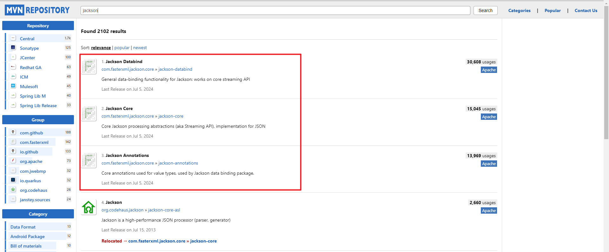

通过查看网站介绍的依赖传递特性：`Jackson Databind` 中，依赖其他两个依赖

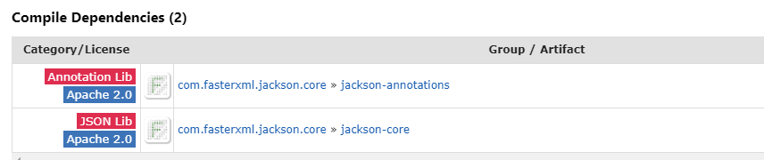

最佳导入：直接可以导入`Jackson Databind`，自动依赖传递需要的依赖

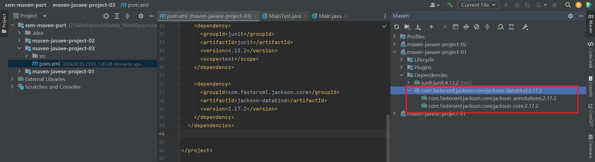

```xml
<!-- https://mvnrepository.com/artifact/com.fasterxml.jackson.core/jackson-databind -->
<dependency>
    <groupId>com.fasterxml.jackson.core</groupId>
    <artifactId>jackson-databind</artifactId>
    <version>2.17.2</version>
</dependency>
```

**依赖冲突演示**：

当直接引用或者间接引用出现了相同的jar包! 这时呢，一个项目就会出现相同的重复jar包，这就算作冲突！依赖冲突避免出现重复依赖，并且终止依赖传递！

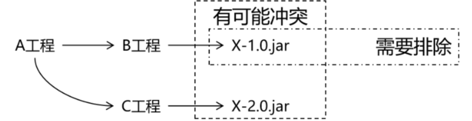

maven自动解决依赖冲突问题能力，会按照自己的原则，进行重复依赖选择。同时也提供了手动解决的冲突的方式，不过不推荐！

**简而言之：发现已经存在依赖（重复依赖），会终止依赖传递，避免循环依赖和重复依赖的问题。**

**依赖冲突发生场景**：重复依赖

**依赖冲突的解决原则**：

第一原则：短路优先原则，谁短谁优先（引用的路径长度）

```bash
# 例如 A 依赖了 B ， B又依赖了X 1.0，D 依赖了 X 2.0
A -> B -> X 1.0

D -> X 2.0

# 最终引入的 X 版本为 X2.0，因为 D->X 相对 A -> B -> X 的引用路径更短
```

第二原则：依赖路径长度相同情况下，则“先声明优先”，谁上谁优先（dependencies声明的先后顺序）

```bash
# 例如 A依赖了 B 1.0, F依赖了 B 2.0,但是在dependencies中 A 先声明
A -> B 1.0
F -> B 2.0

# 在<depencies></depencies>中，先声明的，路径相同，会优先选择！
# 最终引入的先后顺序为 A -> F -> B 1.0
```

小思考

```bash
# 前提：
   A 1.1 -> B 1.1 -> C 1.1 
   F 2.2 -> B 2.2 
   
# pom声明：
   F 2.2
   A 1.1 
   B 2.2 

# 最终引入：  F 2.2 -> A 1.1 -> B 2.2
# 不会引入 C 1.1,只要发生冲突,后续的依赖传递全部终止
```

### 依赖导入失败场景和解决方案

在使用 Maven 构建项目时，可能会发生依赖项下载错误的情况，主要原因有以下几种：

1. 下载依赖时出现网络故障或仓库服务器宕机等原因，导致无法连接至 Maven 仓库，从而无法下载依赖。

2. 依赖项的版本号或配置文件中的版本号错误，或者依赖项没有正确定义，导致 Maven 下载的依赖项与实际需要的不一致，从而引发错误。

   > 报错示例：
   >
   > `Could not find artifact com.fasterxml.jackson.core:jackson-databind:pom:2.17.99 in alimaven`

3. 本地 Maven 仓库或缓存被污染或损坏，导致 Maven 无法正确地使用现有的依赖项，并且也无法重新下载！
	
	 >  本地仓库文件不存在，又不能正常从阿里镜像下载


**解决方案**：

1. 检查网络连接和 Maven 仓库服务器状态(中央仓库，阿里镜像一般没问题，主要是Maven私服)。
2. 确保依赖项的版本号与项目对应的版本号匹配，并检查 POM 文件中的依赖项是否正确。
3. 清除本地 Maven 仓库缓存（`lastUpdated` 文件），因为只要存在`lastupdated`缓存文件，刷新Maven也不会重新下载。本地仓库中，根据依赖的gav属性依次向下查找文件夹，最终删除内部的文件，刷新重新下载即可！

	> 例如： pom.xml依赖
	>
	> ```xml
	> <dependency>
	>   <groupId>com.alibaba</groupId>
	>   <artifactId>druid</artifactId>
	>   <version>1.2.8</version>
	> </dependency>
	> ```
	>
	> 文件：
	>
	> 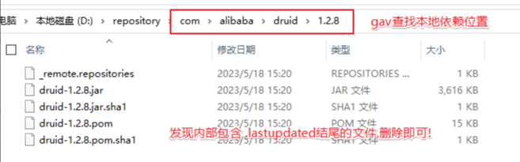
	>
	> 自动清理脚本：
	>
	> 创建`清理maven错误缓存.bat`文件，内容如下
	>
	> ```bash
	> @echo off
	> rem 这里写你的仓库路径
	> set REPOSITORY_PATH=D:\Environment\Maven\apache-maven-3.6.3\maven-repo
	> rem 正在搜索...
	> for /f "delims=" %%i in ('dir /b /s "%REPOSITORY_PATH%\*lastUpdated*"') do (
	>     del /s /q %%i
	> )
	> rem 搜索完毕
	> pause
	> ```
	>
	> 将`REPOSITORY_PATH` 改为自己Maven本地仓库路径
	>
	> 点击运行脚本，即可自动清理本地错误缓存文件！！
	>
	> 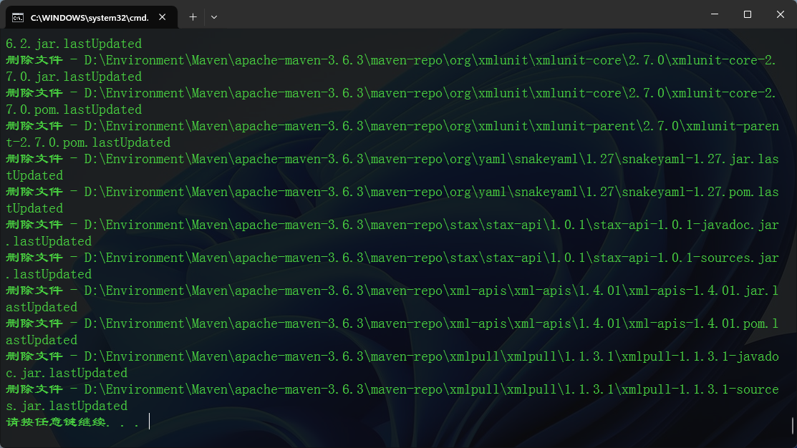
	> 

## 扩展构建管理和插件配置

### **构建概念**

项目构建是指**将源代码、依赖库和资源文件等转换成可执行或可部署的应用程序**的过程，在这个过程中包括编译源代码、链接依赖库、打包和部署等多个步骤。

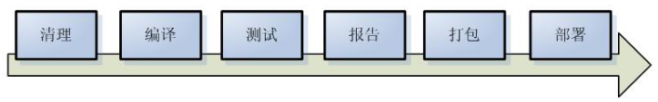

### **主动触发场景**

- 重新编译 : 编译不充分, 部分文件没有被编译!
- 打包 : 独立部署到外部服务器软件,打包部署
- 部署本地或者私服仓库 : maven工程加入到本地或者私服仓库,供其他工程使用

### **命令方式构建**

语法: **mvn 构建命令  构建命令....**

| 命令        | 描述                                        |
| ----------- | ------------------------------------------- |
| mvn clean   | 清理编译或打包后的项目结构,删除target文件夹 |
| mvn compile | 编译项目，生成target文件                    |
| mvn test    | 执行测试源码 (测试)                         |
| mvn site    | 生成一个项目依赖信息的展示页面              |
| mvn package | 打包项目，生成war / jar 文件                |
| mvn install | 打包后上传到maven本地仓库(本地部署)         |
| mvn deploy  | 只打包，上传到maven私服仓库(私服部署)       |

**注意：**

1. 命令执行时需要进入项目根路径(与`pom.xml`文件同级)
2. 部署必须是`jar`包形式


### **可视化方式构建**

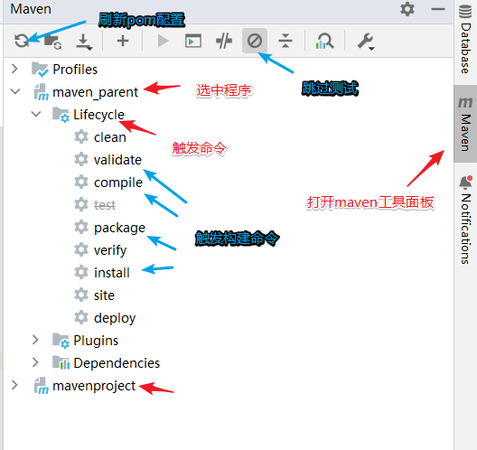

##### **构建命令周期**

构建生命周期可以理解成是一组固定构建命令的有序集合，触发周期后的命令，会自动触发周期前的命令！也是一种简化构建的思路!

- 清理周期：主要是对项目编译生成文件进行清理

    包含命令：clean
- 默认周期：定义了真正构件时所需要执行的所有步骤，它是生命周期中最核心的部分

    包含命令：compile - test - package - install / deploy
- 报告周期

    包含命令：site

    打包: mvn clean package 本地仓库: mvn clean install

##### **最佳使用方案**

```bash
# 打包: 
mvn clean package
# 重新编译: 
mvn clean compile
# 本地部署: 
mvn clean install 
```

##### **周期，命令和插件**

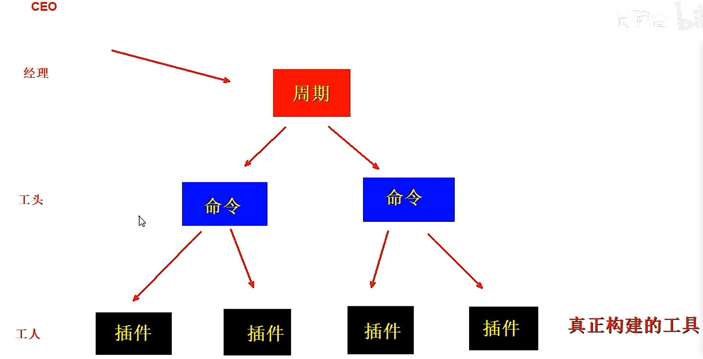

一个周期包含若干命令，一个命令包含若干插件

周期→包含若干命令→包含若干插件!

使用周期命令构建，简化构建过程！

最终进行构建的是插件！

**插件配置**:

```xml
<build>
   <!-- jdk17 和 war包版本插件不匹配 -->
    <plugins>
        <plugin>
            <groupId>org.apache.maven.plugins</groupId>
            <artifactId>maven-war-plugin</artifactId>
            <version>3.2.2</version>
        </plugin>
    </plugins>
</build>
```

# Maven继承和聚合特性

## Maven工程继承关系

### 继承概念

Maven 继承是指在 Maven 的项目中，让一个项目从另一个项目中继承配置信息的机制。继承可以让我们在多个项目中共享同一配置信息，简化项目的管理和维护工作。

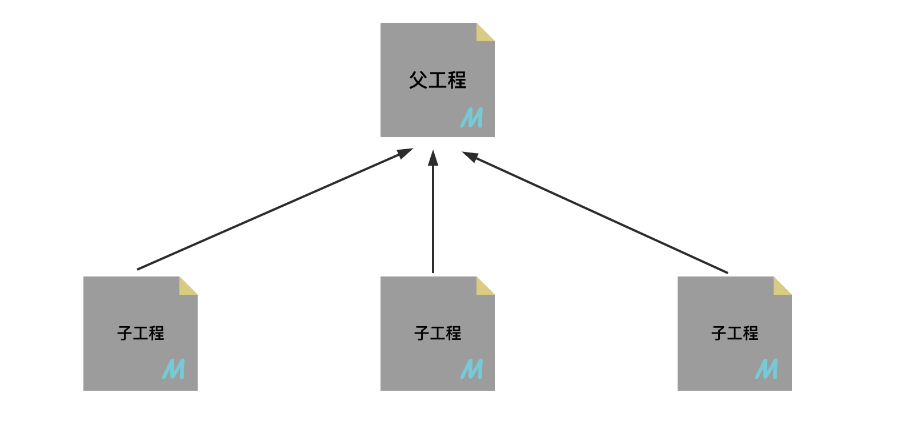

### 继承作用

作用：在父工程中统一管理项目中的依赖信息,进行统一版本管理!

它的背景是：

- 对一个比较大型的项目进行了模块拆分。
- 一个 project 下面，创建了很多个 module。
- 每一个 module 都需要配置自己的依赖信息。

它背后的需求是：

- 多个模块要使用同一个框架，它们应该是同一个版本，所以整个项目中使用的框架版本需要统一管理。
- 使用框架时所需要的 jar 包组合（或者说依赖信息组合）需要经过长期摸索和反复调试，最终确定一个可用组合。这个耗费很大精力总结出来的方案不应该在新的项目中重新摸索。

通过在父工程中为整个项目维护依赖信息的组合既保证了整个项目使用规范、准确的 jar 包；又能够将以往的经验沉淀下来，节约时间和精力。

### 继承语法

**父工程**

```XML
<groupId>com.atguigu.maven</groupId>
<artifactId>pro03-maven-parent</artifactId>
<version>1.0-SNAPSHOT</version>
<!-- 当前工程作为父工程，它要去管理子工程，所以打包方式必须是 pom -->
<packaging>pom</packaging>

```
**子工程**

```XML
<!-- 使用parent标签指定当前工程的父工程 -->
<parent>
  <!-- 父工程的坐标 -->
  <groupId>com.atguigu.maven</groupId>
  <artifactId>pro03-maven-parent</artifactId>
  <version>1.0-SNAPSHOT</version>
</parent>

<!-- 子工程的坐标 -->
<!-- 如果子工程坐标中的groupId和version与父工程一致，那么可以省略 -->
<!-- <groupId>com.atguigu.maven</groupId> -->
<artifactId>pro04-maven-module</artifactId>
<!-- <version>1.0-SNAPSHOT</version> -->
```

### 父工程依赖统一管理

**父工程声明版本**

```xml
<!-- 使用dependencyManagement标签配置对依赖的管理 -->
<!-- 被管理的依赖并没有真正被引入到工程 -->
<dependencyManagement>
  <dependencies>
    <dependency>
      <groupId>org.springframework</groupId>
      <artifactId>spring-core</artifactId>
      <version>4.0.0.RELEASE</version>
    </dependency>
    <dependency>
      <groupId>org.springframework</groupId>
      <artifactId>spring-beans</artifactId>
      <version>4.0.0.RELEASE</version>
    </dependency>
    <dependency>
      <groupId>org.springframework</groupId>
      <artifactId>spring-context</artifactId>
      <version>4.0.0.RELEASE</version>
    </dependency>
    <dependency>
      <groupId>org.springframework</groupId>
      <artifactId>spring-expression</artifactId>
      <version>4.0.0.RELEASE</version>
    </dependency>
    <dependency>
      <groupId>org.springframework</groupId>
      <artifactId>spring-aop</artifactId>
      <version>4.0.0.RELEASE</version>
    </dependency>
  </dependencies>
</dependencyManagement>
```

** **

```xml
<!-- 子工程引用父工程中的依赖信息时，可以把版本号去掉。  -->
<!-- 把版本号去掉就表示子工程中这个依赖的版本由父工程决定。 -->
<!-- 具体来说是由父工程的dependencyManagement来决定。 -->
<dependencies>
  <dependency>
    <groupId>org.springframework</groupId>
    <artifactId>spring-core</artifactId>
  </dependency>
  <dependency>
    <groupId>org.springframework</groupId>
    <artifactId>spring-beans</artifactId>
  </dependency>
  <dependency>
    <groupId>org.springframework</groupId>
    <artifactId>spring-context</artifactId>
  </dependency>
  <dependency>
    <groupId>org.springframework</groupId>
    <artifactId>spring-expression</artifactId>
  </dependency>
  <dependency>
    <groupId>org.springframework</groupId>
    <artifactId>spring-aop</artifactId>
  </dependency>
</dependencies>
```


## Maven工程聚合关系

### 聚合概念

Maven 聚合是指将多个项目组织到一个父级项目中，通过触发父工程的构建,统一按顺序触发子工程构建的过程!!

### 聚合作用

1. 统一管理子项目构建：通过聚合，可以将多个子项目组织在一起，方便管理和维护。
2. 优化构建顺序：通过聚合，可以对多个项目进行顺序控制，避免出现构建依赖混乱导致构建失败的情况。

### 聚合语法

父项目中包含的子项目列表。

```XML
<project>
  <groupId>com.example</groupId>
  <artifactId>parent-project</artifactId>
  <packaging>pom</packaging>
  <version>1.0.0</version>
  <modules>
    <module>child-project1</module>
    <module>child-project2</module>
  </modules>
</project>
```
### 聚合演示

通过触发父工程构建命令、引发所有子模块构建！产生反应堆！

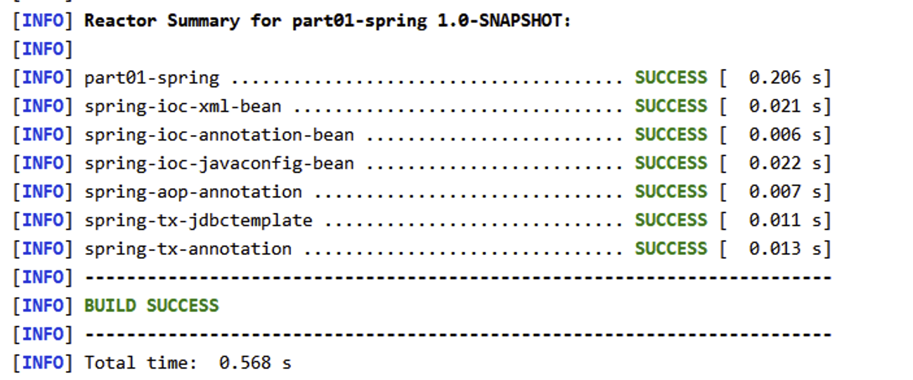

# Maven实战案例：搭建微服务Maven工程架构

## 项目需求和结构分析

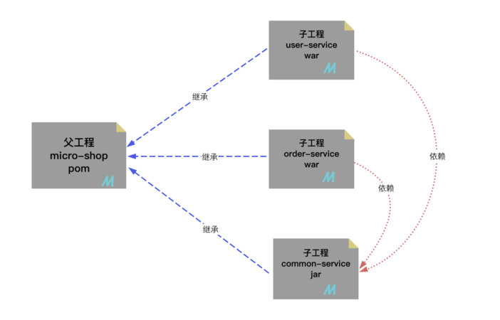

需求案例：搭建一个电商平台项目，该平台包括用户服务、订单服务、通用工具模块等。

项目架构：

1. 用户服务：负责处理用户相关的逻辑，例如用户信息的管理、用户注册、登录等。
2. 订单服务：负责处理订单相关的逻辑，例如订单的创建、订单支付、退货、订单查看等。
3. 通用模块：负责存储其他服务需要通用工具类，其他服务依赖此模块。

服务依赖：

1. 用户服务 (1.0.1)
    - spring-context 6.0.6 
    - spring-core 6.0.6
    - spring-beans 6.0.6
    - jackson-databind /  jackson-core / jackson-annotations 2.15.0 
2. 订单服务 (1.0.1)
    1. shiro-core 1.10.1 
    2. spring-context 6.0.6 
    3. spring-core 6.0.6
    4. spring-beans 6.0.6
3. 通用模块 (1.0.1)
    1. commons-io 2.11.0

## 项目搭建和统一构建

### 父模块搭建 (micro-shop)

父模块搭建

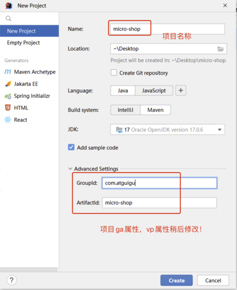

`pom.xml`配置

```xml
<?xml version="1.0" encoding="UTF-8"?>
<project xmlns="http://maven.apache.org/POM/4.0.0"
         xmlns:xsi="http://www.w3.org/2001/XMLSchema-instance"
         xsi:schemaLocation="http://maven.apache.org/POM/4.0.0 http://maven.apache.org/xsd/maven-4.0.0.xsd">
    <modelVersion>4.0.0</modelVersion>

    <groupId>com.atguigu</groupId>
    <artifactId>micro-shop</artifactId>
    <version>1.0.1</version>
    <!-- 父工程不打包，所以选择pom值-->
    <packaging>pom</packaging>

    <properties>
        <spring.version>6.0.6</spring.version>
        <jackson.version>2.15.0</jackson.version>
        <shiro.version>1.10.1</shiro.version>
        <commons.version>2.11.0</commons.version>
        <maven.compiler.source>17</maven.compiler.source>
        <maven.compiler.target>17</maven.compiler.target>
        <project.build.sourceEncoding>UTF-8</project.build.sourceEncoding>
    </properties>

    <!-- 依赖管理 -->
    <dependencyManagement>
        <dependencies>
            <!-- spring-context会依赖传递core/beans -->
            <dependency>
                <groupId>org.springframework</groupId>
                <artifactId>spring-context</artifactId>
                <version>${spring.version}</version>
            </dependency>

            <!-- jackson-databind会依赖传递core/annotations -->
            <dependency>
                <groupId>com.fasterxml.jackson.core</groupId>
                <artifactId>jackson-databind</artifactId>
                <version>${jackson.version}</version>
            </dependency>

            <!-- shiro-core -->
            <dependency>
                <groupId>org.apache.shiro</groupId>
                <artifactId>shiro-core</artifactId>
                <version>${shiro.version}</version>
            </dependency>
            <!-- commons-io -->
            <dependency>
                <groupId>commons-io</groupId>
                <artifactId>commons-io</artifactId>
                <version>${commons.version}</version>
            </dependency>

        </dependencies>

    </dependencyManagement>

    <dependencies>
        <!-- 父工程添加依赖，会自动传递给所有子工程，不推荐！ -->
    </dependencies>

    <!-- 统一更新子工程打包插件-->
    <build>
        <!-- jdk17 和 war包版本插件不匹配 -->
        <plugins>
            <plugin>
                <groupId>org.apache.maven.plugins</groupId>
                <artifactId>maven-war-plugin</artifactId>
                <version>3.2.2</version>
            </plugin>
        </plugins>
    </build>

</project>
```

### 通用模块 (common-service)

**创建模块**

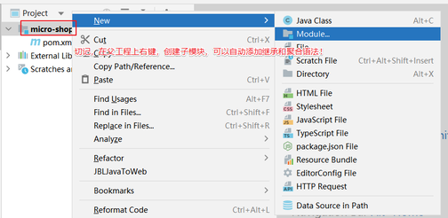

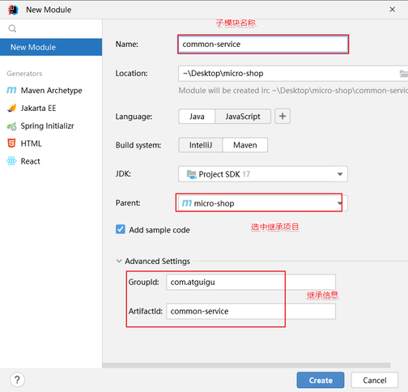

`pom.xml`配置

```XML
<?xml version="1.0" encoding="UTF-8"?>
<project xmlns="http://maven.apache.org/POM/4.0.0"
         xmlns:xsi="http://www.w3.org/2001/XMLSchema-instance"
         xsi:schemaLocation="http://maven.apache.org/POM/4.0.0 http://maven.apache.org/xsd/maven-4.0.0.xsd">
    <modelVersion>4.0.0</modelVersion>
    <parent>
        <groupId>com.atguigu</groupId>
        <artifactId>micro-shop</artifactId>
        <version>1.0.1</version>
    </parent>
    <artifactId>common-service</artifactId>
    <!-- 打包方式默认就是jar！ -->
    <packaging>jar</packaging>

    <properties>
        <maven.compiler.source>17</maven.compiler.source>
        <maven.compiler.target>17</maven.compiler.target>
        <project.build.sourceEncoding>UTF-8</project.build.sourceEncoding>
    </properties>

    <dependencies>
        <!-- 声明commons-io，继承父工程版本 -->
        <dependency>
            <groupId>commons-io</groupId>
            <artifactId>commons-io</artifactId>
        </dependency>
    </dependencies>

</project>
```

### 用户模块 (user-service)

创建模块

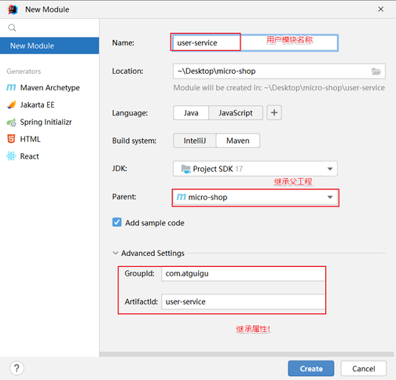


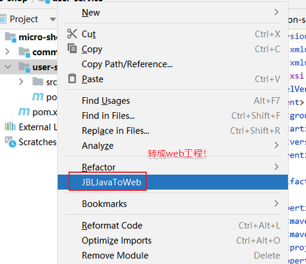

`pom.xml`配置

```XML
<?xml version="1.0" encoding="UTF-8"?>

<project xmlns="http://maven.apache.org/POM/4.0.0" xmlns:xsi="http://www.w3.org/2001/XMLSchema-instance" xsi:schemaLocation="http://maven.apache.org/POM/4.0.0 http://maven.apache.org/xsd/maven-4.0.0.xsd">  
  <modelVersion>4.0.0</modelVersion>  
  <parent> 
    <groupId>com.atguigu</groupId>  
    <artifactId>micro-shop</artifactId>  
    <version>1.0.1</version> 
  </parent>  
  <artifactId>user-service</artifactId>  
  <packaging>war</packaging>

  <properties> 
    <maven.compiler.source>17</maven.compiler.source>  
    <maven.compiler.target>17</maven.compiler.target>  
    <project.build.sourceEncoding>UTF-8</project.build.sourceEncoding> 
  </properties>

  <dependencies>
    <!-- 添加spring-context 自动传递 core / beans -->
    <dependency>
      <groupId>org.springframework</groupId>
      <artifactId>spring-context</artifactId>
    </dependency>

    <!-- 添加jackson-databind 自动传递 core / annotations -->
    <dependency>
      <groupId>com.fasterxml.jackson.core</groupId>
      <artifactId>jackson-databind</artifactId>
    </dependency>
  </dependencies>
</project>
```

### 订单模块 (order-service)

创建模块

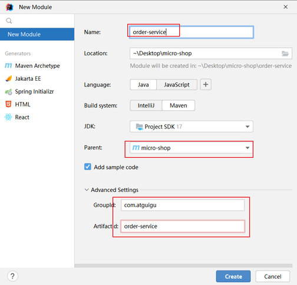


`pom.xml`

```XML
<?xml version="1.0" encoding="UTF-8"?>
<project xmlns="http://maven.apache.org/POM/4.0.0"
         xmlns:xsi="http://www.w3.org/2001/XMLSchema-instance"
         xsi:schemaLocation="http://maven.apache.org/POM/4.0.0 http://maven.apache.org/xsd/maven-4.0.0.xsd">
    <modelVersion>4.0.0</modelVersion>
    <parent>
        <groupId>com.atguigu</groupId>
        <artifactId>micro-shop</artifactId>
        <version>1.0.1</version>
    </parent>

    <artifactId>order-service</artifactId>
    <packaging>war</packaging>

    <properties>
        <maven.compiler.source>17</maven.compiler.source>
        <maven.compiler.target>17</maven.compiler.target>
        <project.build.sourceEncoding>UTF-8</project.build.sourceEncoding>
    </properties>

    <dependencies>
        <!-- 继承父工程依赖版本 -->
        <dependency>
            <groupId>org.springframework</groupId>
            <artifactId>spring-context</artifactId>
        </dependency>

        <!-- 继承父工程依赖版本 -->
        <dependency>
            <groupId>org.apache.shiro</groupId>
            <artifactId>shiro-core</artifactId>
        </dependency>
    </dependencies>

</project>
```

# Maven核心掌握总结

|              |                                                    |
| ------------ | -------------------------------------------------- |
| 核心点       | 掌握目标                                           |
| 安装         | maven安装、环境变量、maven配置文件修改             |
| 工程创建     | gavp属性理解、JavaSE/EE工程创建、项目结构          |
| **依赖管理** | **依赖添加、依赖传递、版本提取、导入依赖错误解决** |
| 构建管理     | 构建过程、构建场景、构建周期等                     |
| 继承和聚合   | 理解继承和聚合作用、继承语法和实践、聚合语法和实践 |
